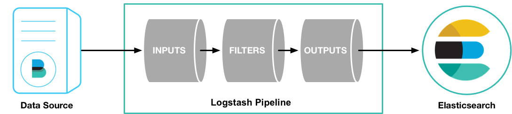

# elasticsearch-study

## 基本概念

### ElasticSearch

#### 什么是ElasticSearch？

首推官网的解释： https://www.elastic.co/guide/en/elasticsearch/reference/7.11/elasticsearch-intro.html。

我简单总结下，ES（ElasticSearch的缩写，下文大写的ES都表示ElasticSearch）是一个分布式的搜索和分析引擎，可以通过Logstash、Beats收集数据，并将其存储在ES中。然后通过Kibana可视化的展示、分析你存储的数据。上述就著名的ELK三件套，当然L不是必需的，数据也可以自己写入。

ES不同于传统关系型数据库(RDBMS)，ES不是将数据转为一列列的数据行，而是存储已经序列化为JSON文档的复杂数据结构。这些文档分布在集群中，可以从任何节点上立即访问。当文档被存储时，它就会被编入索引，并且在1秒内就可以被搜索到，可以做到近实时。

ES使用的是一种被称为倒排索引的数据结构，倒排索引会列出文档中每一个单词，并标识出这些单词出现过的所有文档。所以，如果拿ES当搜索引擎使用，怎么分词是非常重要的。

#### 应用场景

- 搜索类场景，比如电商网站、招聘网站、新闻资讯等各类应用，只要涉及到搜索功能，都可以用ES来做。
- 日志平台，经典的ELK三件套，日志的收集、存储、分析一套完成，省心又省力。

- 数据分析，比如筛选出topN访问量的页面。

#### 核心概念

- 索引（Index）：类似关系型数据库中的数据库，通常一类数据只放到一个索引中。比如A系统的日志，就放到log_a索引中。系统B的访问量统计，就放到pv_b中。
- 类型（type）：这个概念每个版本变动都比较大，ES5.X中一个index可以有多种type，6.X中一个index只能有一个type，7.X中要逐渐移除这个概念。type表示这个文档是该index中，哪一个类别的。如果非要和关系型数据库做个类比，可以想象成表。

- 文档（document）：文档就是一条JSON数据，类似于关系型数据库中的一行数据。
- 映射（mapping）：mapping定义了文档中，每个字段的类型等信息，类似于关系型数据库中的表结构。

### Kibana				 						 					

Kibana是一个基于Node.js的可视化工具，可以利用ES的聚合功能，生成柱状图、饼图、折线图等各类图标。而且还提供了操作ES的控制台（Dev Tools），可以直接在控制台中输入RESTful API来操作ES,并且提供了一定的API提示和语法高亮，有助于我们对ES API的学习。

Kibana没有太多复杂的概念，我们只要会用即可。最后整合ELK时，我会介绍一些基本的用法。也可以看看官方文档，里面还有视频教程：https://www.elastic.co/guide/en/kibana/7.11/introduction.html。

### Logstash

贴一张官方的图，Logstash的作用一目了然：



Logstash是一个具有实时收集数据的开源引擎，Logstash可以收集不同的数据源，然后将数据规范化的输出到你的目的地，也就是ES。

Logstash有三个重要的组成部分，inputs、filters、outputs。inputs和outputs是必需的，需要我们配置数据的输入源和数据的输出源。而在实际中，filters更为重要，它可以按照你指定的规则，过滤、操作数据。数据的格式统一，存入到ES后，有助于我们分析、查询这些数据。

## 系统环境和软件准备

### 操作系统

CentOS7

### JDK

JDK8

```shell
yum install -y java-1.8.0-openjdk
```

### ElasticSearch

版本号7.11，Kibana、Logstash和ES版本保持一致。

```shell
#下载es7.11压缩包
wget https://artifacts.elastic.co/downloads/elasticsearch/elasticsearch-7.11.0-linux-x86_64.tar.gz
```

### Kibana

```shell
wget https://artifacts.elastic.co/downloads/kibana/kibana-7.11.0-linux-x86_64.tar.gz
```

### Logstash

```shell
wget https://artifacts.elastic.co/downloads/logstash/logstash-7.11.0-linux-x86_64.tar.gz
```


## 快速开始

### ElasticSearch

```shell
# 解压压缩包
tar -zxvf elasticsearch-7.11.0-linux-x86_64.tar.gz
# 移至你专门放软件的目录，尽量别在root根目录
mv elasticsearch-7.11.0 /usr/elasticsearch/
# 修改配置文件
vim /usr/elasticsearch/elasticsearch-7.11.0/config/elasticsearch.yml
```

单机启动只需简单修改如下几项配置即可。如果是运维的朋友，可以去官方文档了解更多的配置信息：https://www.elastic.co/guide/en/elasticsearch/reference/7.11/settings.html。根据右侧目录可以快速找到自己想看的配置主题，比如Network settings。

```shell
node.name: node-1
# 因为我部署在云服务器上，想要外网访问这里要配置成0.0.0.0
# 如果是虚拟机的话就配置成ip地址，
# 如果是本机可以不改此项，默认绑到本机
# 可参考文档：https://www.elastic.co/guide/en/elasticsearch/reference/7.11/modules-network.html
network.host: 0.0.0.0 
# 如果是云服务器记得在防火墙里添加9200、9300，后面Kibana用到的5601端口也要记得添加
http.port: 9200
cluster.initial_master_nodes: ["node-1"]
```

根据自己的机器配置，按需修改JVM内存配置。ES默认配置是1G，考虑到后面会启动Kibana，可以增加一些。

```shell
vim /usr/elasticsearch/elasticsearch-7.11.0/config/jvm.options

# 配置初始和最大堆内存
 -Xms2g
 -Xmx2g
```

添加es用户，es默认root用户无法启动，所以需要新建一个用户

```shell
useradd es # 新建用户
passwd es # 修改密码
chown -R es /usr/elasticsearch/ #赋予软件包所在目录的权限
```

Elasticsearch 默认情况下使用 mmapfs 目录来存储其索引。mmap 计数的默认限制可能太低，这可能导致内存不足异常。可以以root身份运行以下命令增加限制

```shell
sysctl -w vm.max_map_count=655360
```

如果要永久更改这个限制可以去系统文件中修改

```shell
vim /etc/sysctl.conf

# 末尾添加如下内容
vm.max_map_count=655360

# :wq后，使新增内容生效
sysctl -p
```

ES同样会用到大量线程池，所以我们也需要修改一些配置，确保ES可以创建的线程数量至少为4096个。

```shell
vim /etc/security/limits.conf

# 文末添加
es - nofile  65535
```

切换到es用户，然后启动ES

```shell
su es
/usr/elasticsearch/elasticsearch-7.11.0/bin/elasticsearch
```

观察启动日志，如果你的版本和我一样，并且没有遗漏什么配置，应该都能正常启动。如果没有正常启动，根据日志解决问题即可。如果看不明白日志，自行Google。

新建一个终端，或者打开浏览器，访问ip:port，如果返回如下信息，就表示启动成功。

```shell
curl http://ip:9200/

# 响应信息
{
  "name" : "node-1",
  "cluster_name" : "elasticsearch",
  "cluster_uuid" : "uAIt_QYIQTy0YkATySbDhw",
  "version" : {
    "number" : "7.11.0",
    "build_flavor" : "default",
    "build_type" : "tar",
    "build_hash" : "8ced7813d6f16d2ef30792e2fcde3e755795ee04",
    "build_date" : "2021-02-08T22:44:01.320463Z",
    "build_snapshot" : false,
    "lucene_version" : "8.7.0",
    "minimum_wire_compatibility_version" : "6.8.0",
    "minimum_index_compatibility_version" : "6.0.0-beta1"
  },
  "tagline" : "You Know, for Search"
}
```

到此为止，单机版ES启动完毕，说的比较详细，后面的Kibana会适当简略一点。建议有能力的，还是根据自己的需求过一遍文档。可以不用全部看完，运维的朋友可以着重看看配置、集群管理、监控等相关章节。开发的朋友可以着重看看API、client、Mapping、DSL等。

### Kibana

解压、移动

```shell
tar -zxvf kibana-7.11.0-linux-x86_64.tar.gz
mv kibana-7.11.0-linux-x86_64 /usr/kibana/
```

赋予es用户Kibana目录权限

```shell
chown -R es /usr/kibana/
```

修改配置文件

```shell
vim /usr/kibana/kibana-7.11.0-linux-x86_64/config/kibana.yml
```

配置内容如下：

```shell
server.port: 5601
server.host: "0.0.0.0"
# 如果ES和Kibana不在同一台机器上，这里改成ES所在机器的IP
elasticsearch.hosts: ["http://localhost:9200"]
```

启动Kibana，观察日志有没有报错

```shell
su es
/usr/kibana/kibana-7.11.0-linux-x86_64/bin/kibana
```

进入Kibana可视化页面，打开浏览器，输入ip:5601


### Logstash

解压、移动、赋予目录权限

```shell
tar -zxvf logstash-7.11.0-linux-x86_64.tar.gz
mv logstash-7.11.0 /usr/logstash/
chown -R es /usr/logstash/
```

配置input、output。filter我们暂时不配置，下面的SpringBoot整合ELK再演示filter。

```shell
su es
# 先进到配置文件目录，复制一份配置模板
cd /usr/logstash/logstash-7.11.0/config/
cp logstash-sample.conf logstash.conf
# 配置输入输出
vim logstash.conf
```

填入如下内容：

```shell
input {
  file {
    path => ["/usr/log/movies.csv"] # 待导入数据的目录
    start_position => "beginning" # 头从开始
  }
}
filter {
  csv {
    separator => ","
    columns => ["id","content","genre"]
  }

  mutate {
    split => { "genre" => "|" }
    remove_field => ["path", "host","@timestamp","message"]
  }

  mutate {

    split => ["content", "("]
    add_field => { "title" => "%{[content][0]}"}
    add_field => { "year" => "%{[content][1]}"}
  }

  mutate {
    convert => {
      "year" => "integer"
    }
    strip => ["title"]
    remove_field => ["path", "host","@timestamp","message","content"]
  }

}
output {
   elasticsearch {
     hosts => "http://localhost:9200"
     index => "movies"
     document_id => "%{id}"
   }
}
                     
```

在启动Logstash前我们先往/usr/log/目录中放些数据，数据集我是在网上找的，地址：https://grouplens.org/datasets/movielens/。大家可以根据自己的网速、硬盘大小下载，网速慢的就下个小点的数据集。然后复制到/usr/log/目录下即可。

```shell
# 下载测试的数据集
wget https://files.grouplens.org/datasets/movielens/ml-latest-small.zip
unzip ml-latest-small.zip 
cd ml-latest-small/
cp movies.csv /usr/log/

# 加载指定配置文件，启动Logstash
/usr/logstash/logstash-7.11.0/bin/logstash -f /usr/logstash/logstash-7.11.0/config/logstash.conf
```

观察日志，看是否正常启动。我第一次启动时，由于ELK都部署在同一台云服务（4G内存），内存不足启动失败，可以去Logstash的jvm配置文件里面适当减小最小堆内存即可。


导入成功后，就可以去Kibana的Index Management页面看到这个数据集了。


## SpringBoot整合ELK


参考资料：https://www.elastic.co/guide/index.html


## 
